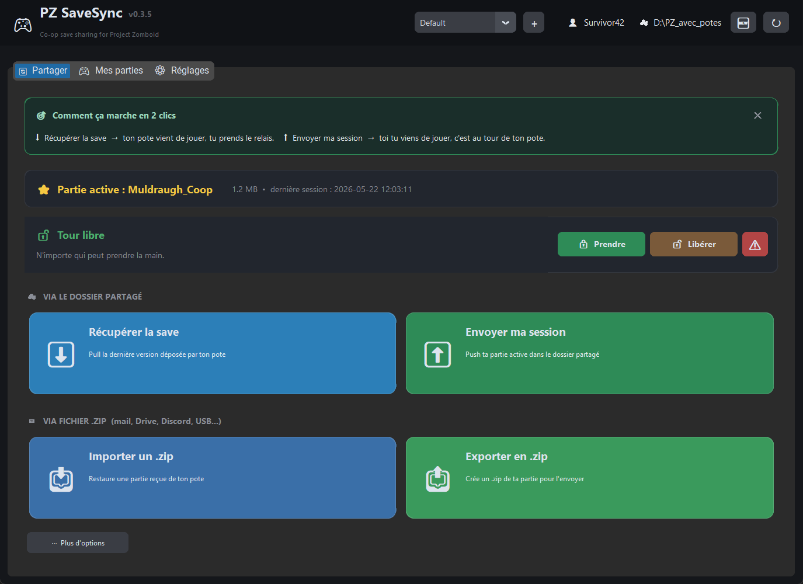
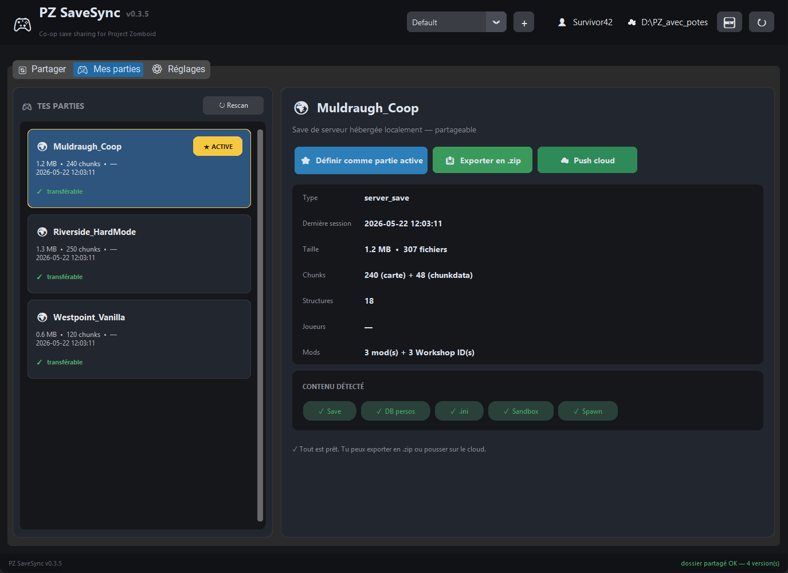
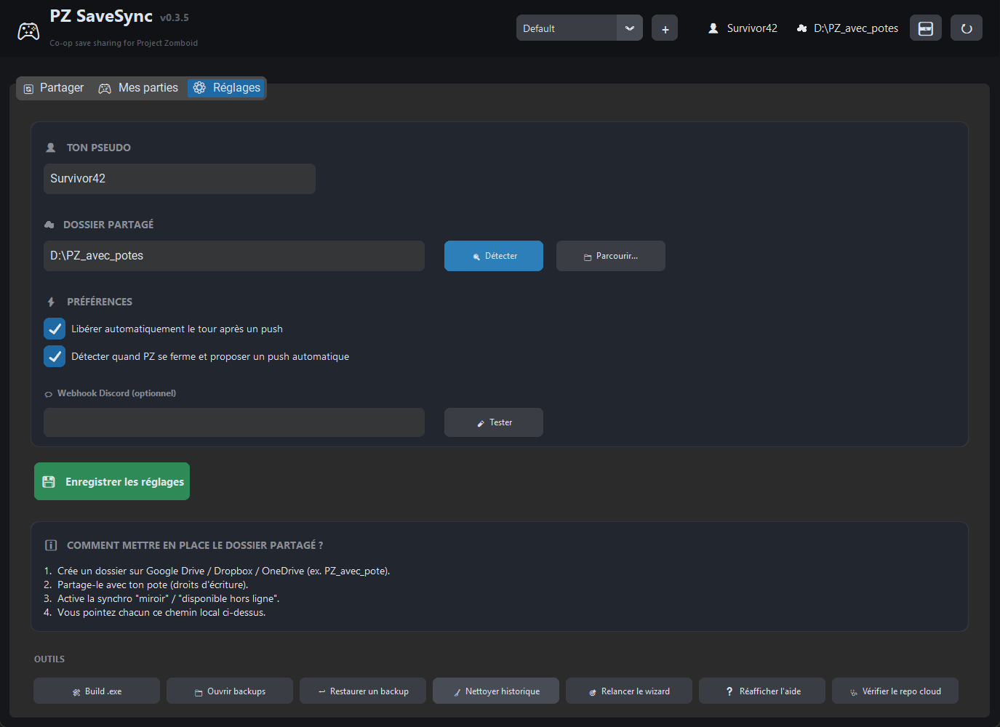

<div align="center">

# 🎮 PZ SaveSync

### Share your Project Zomboid save with your friends in 2 clicks.

[🇫🇷 Français](README.md) · **🇬🇧 English**


</div>

---

## 🎯 The problem, in one sentence

You play PZ co-op with friends. Every time someone else wants to host the next session, **someone has to manually zip 5 files / folders**, send them via WeTransfer, and pray nobody overwrites the other's save.

**PZ SaveSync does that for you with 2 buttons.**



---

## 🚀 How it works

<table width="100%">
<tr>
<td width="50%" valign="top">

### 📥 Pull your friend's save

> *« My friend ended their session, my turn to host. »*

Click **⬇ Pull save**.
The app downloads the latest version from the shared folder, backs up your current state just in case, and tells you **« launch PZ → Multiplayer → Host »**.

</td>
<td width="50%" valign="top">

### 📤 Push your save to your friends

> *« I'm done playing, I want my friend to take over. »*

Click **⬆ Push my session**.
The app bundles your world, the player DB and server config, drops it in the shared folder. Your friend just clicks **Pull**.

</td>
</tr>
</table>

> 🔒 **Nobody overwrites anyone's save**: a turn lock prevents concurrent pushes.
> 💾 **You can always roll back**: an auto-backup is created before every pull, restorable in 1 click.
> ✅ **No bytes lost**: bit-for-bit transfer, SHA256 hashes, end-to-end audit.

---

## 📥 Installation (Windows, 30 seconds)

1. Go to the [Releases](https://github.com/Mistercarmi/PZSaveSync/releases/latest) page
2. Download **`PZSaveSync.exe`**
3. Double-click

That's it. No Python to install, no account to create. On first launch, a wizard asks for your nickname and the path to your shared Dropbox/Drive/OneDrive folder.

> ℹ️ Windows SmartScreen will warn « unknown publisher » (exe not code-signed). Click **« More info » → « Run anyway »**.

### Linux / macOS

```bash
git clone https://github.com/Mistercarmi/PZSaveSync
cd PZSaveSync
pip install -r requirements.txt
python -m pzsavesync
```

---

## 🖥 App preview

| My saves | Settings |
|:---:|:---:|
|  |  |
| All your saves auto-detected. Non-exportable ones are greyed out. | Nickname + shared folder, fits in 2 fields. |

---

## ❓ FAQ

**What if my friend doesn't have the same mods as me?**
The app extracts the mod list from your save and **displays Steam Workshop links directly at import**. Your friend just has to click to subscribe.

**Does my friend lose their character when they become host?**
**No.** PZ stores characters in the DB by SteamID. When your friend hosts, their character stays theirs, and you find yours back when you join.

**What if we both push at the same time?**
The app sets a **turn lock** when someone takes the turn. If you try to push while the lock is taken, the app warns you.

**What if I mess up?**
Before every pull, a **timestamped backup** of your current state is created in `~/PZSaveSync_LocalBackups/`. The **↩ Restore a backup** button brings you back to any previous state in 2 clicks.

**Is it really free?**
Yes. No limits, no account, no ads, no in-app purchases. The source is public, you can audit it and build it yourself.

---

## 📜 License

**Source Available — All rights reserved.** You can read the code and use it for personal purposes. See [LICENSE](LICENSE).

---

<div align="center">

*Made for the long nights of looting Muldraugh with your friends. 🌙*

</div>
